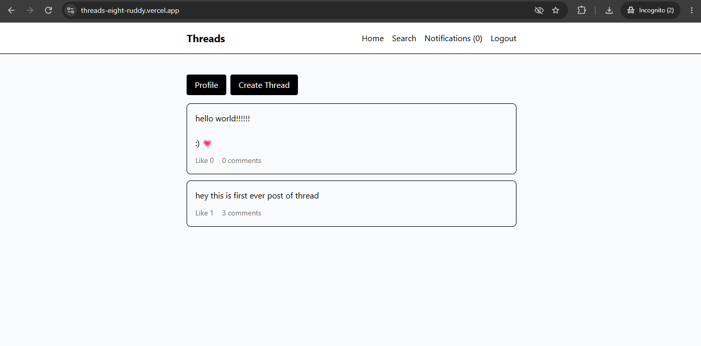
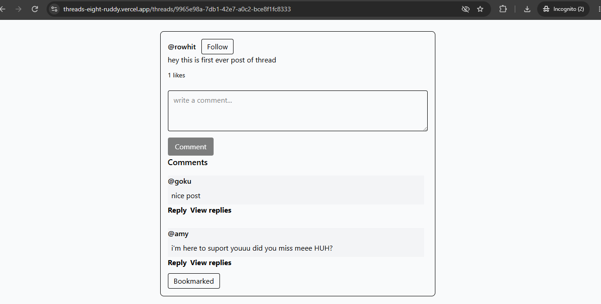
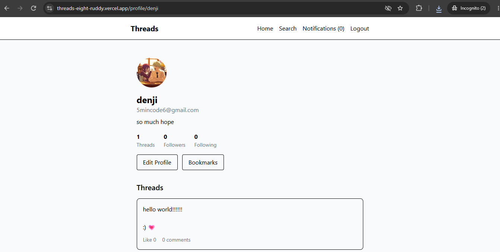
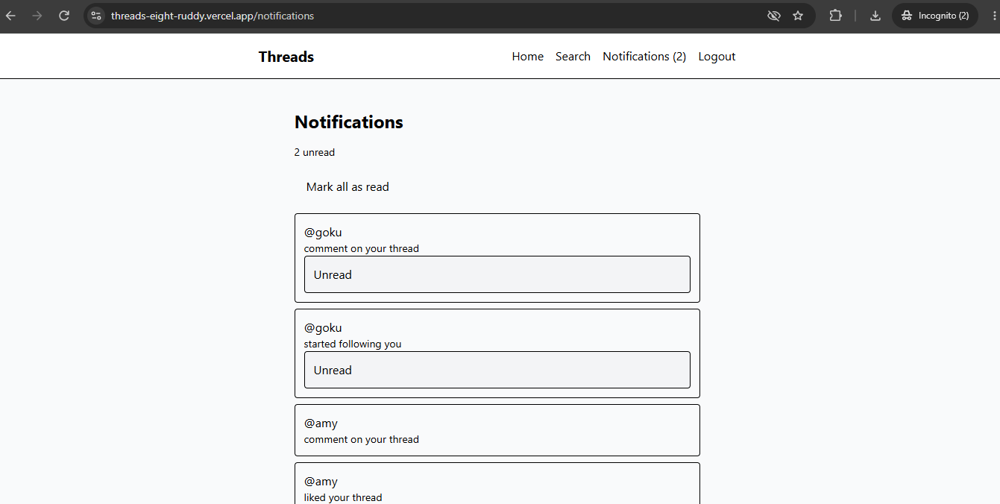
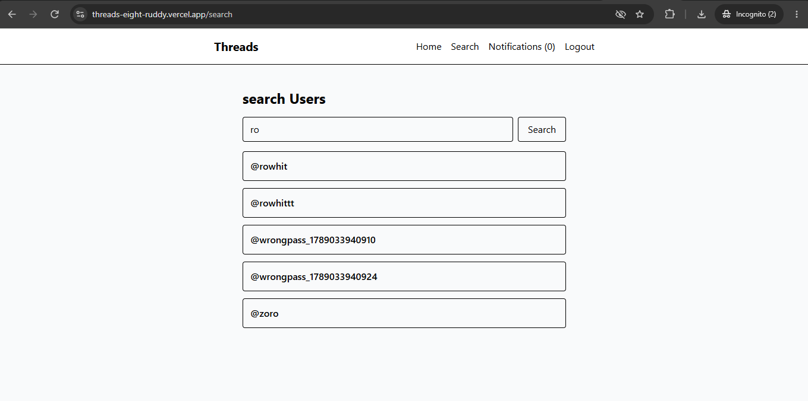
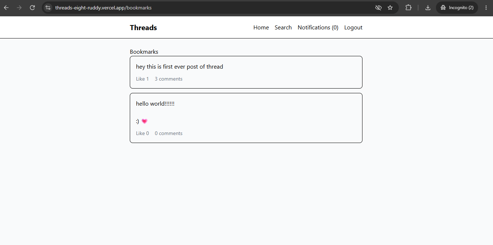
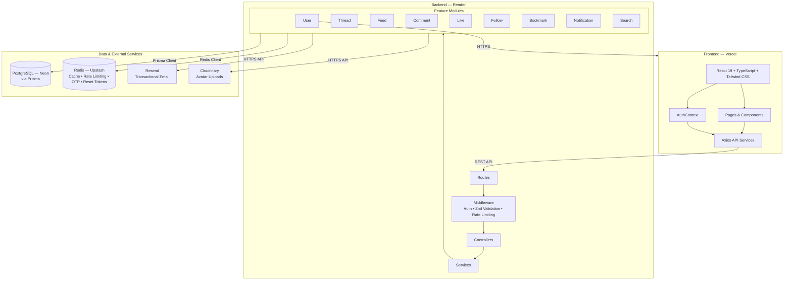

# Threads

A full-stack social media app inspired by Threads. Built to practice real backend engineering — not just CRUD, but auth, caching, pagination, transactions, testing, CI, and production deployment.

Users can post threads, follow each other, like and comment on posts, reply to comments, bookmark content, search for users, and get in-app notifications.

**Live:** https://threads-eight-ruddy.vercel.app

---

## Screenshots

### Home Feed


### Thread & Comments


### Profile


### Notifications


### Search


### Bookmarks


---

## Features

- Signup and login with JWT authentication
- Email verification with OTP
- Password reset via email
- Create, edit, and delete threads
- Personalized feed with Redis caching
- Like and unlike threads
- Comments and nested replies
- Follow and unfollow users
- Bookmarks
- User search
- In-app notifications (likes, follows, comments)
- Profile editing with avatar upload
- Ownership-based authorization
- Redis-backed rate limiting
- Backend integration tests
- GitHub Actions CI with protected main branch

---

## Architecture



**Backend module structure**

Each feature has its own folder with a route, controller, service, and validation file.

```
src/modules/
├── user/
├── thread/
├── feed/
├── comments/
├── follow/
├── like/
├── bookmarks/
├── notification/
└── search/
```

Request lifecycle:

```
Route → Middleware → Controller → Service → Prisma / Redis / External APIs
```

---

## Tech Stack

**Backend**
- Node.js, Express 5, TypeScript
- PostgreSQL + Prisma ORM
- Redis
- Zod (request validation)
- JWT + bcrypt
- Helmet, CORS
- Resend (transactional email)
- Cloudinary (avatar uploads)

**Frontend**
- React 19, TypeScript, Vite
- React Router v7
- Axios
- Tailwind CSS v4

**Testing & CI**
- Jest, Supertest, SWC/Jest
- GitHub Actions

**Production**
- Vercel (frontend)
- Render (backend)
- Neon (PostgreSQL)
- Upstash (Redis)
- Resend (email)

---

## Engineering Highlights

### Authentication

Access tokens are short-lived JWTs (6h) kept in frontend memory only — never in localStorage. Refresh tokens are long-lived JWTs (30d) stored in an HttpOnly cookie.

On page load, the frontend calls the refresh endpoint using the cookie to get a new access token, then hydrates the user state. The Axios response interceptor handles 401s by silently attempting a token refresh and retrying the original request once before giving up.

### Email — Resend over HTTPS

Email verification and password reset originally used Nodemailer with Gmail SMTP. This worked locally but failed in production because Render's free tier blocks outbound SMTP ports (465, 587).

Switched to Resend, which delivers email through an HTTPS API instead of SMTP. This works from any hosting environment regardless of port restrictions.

OTP verification flow:
```
Signup → generate OTP → store in Redis (5min TTL) → send via Resend → user submits OTP → verify → delete from Redis
```

Password reset flow:
```
Request → generate random token → store in Redis (15min TTL) → email reset link → user submits new password → delete from Redis
```

### Feed Caching

The personalized feed uses a cache-aside strategy. Redis only caches thread IDs and pagination metadata — not the full thread objects.

On a cache hit, the backend uses those IDs to query PostgreSQL for current thread data and like state. This means `likesCount` and `isLiked` are always fresh from the database, while the expensive follow-graph query (finding all users you follow) is skipped.

Cache key: `feed:user:{userId}:cursor:{cursor}:limit:{limit}` — 60 second TTL.

Cache is invalidated when a user follows or unfollows someone, or when a new thread is created. Like/unlike does not invalidate the cache because like state is always read from PostgreSQL anyway.

### Cursor Pagination

Feed, threads, comments, replies, bookmarks, and notifications all use cursor-based pagination. The cursor is the ID of the last item in the current page. This avoids the row-drift problem that offset pagination has on frequently updated data.

User search uses offset pagination since it's a simpler ordered result set.

### Prisma Transactions

Anywhere multiple writes need to stay consistent, Prisma transactions are used:

- Like/unlike → updates `Like` table + `Thread.likesCount`
- Follow/unfollow → updates `Follow` table + `followerCount` + `followingCount` on both users
- Comment/reply creation → creates `Comment` + increments `Thread.commentsCount`
- Comment soft-delete → sets `deletedAt` + decrements `Thread.commentsCount`
- Notifications are created inside the same transaction as the triggering action

### Ownership & Authorization

Authorization is enforced at the database query level, not just middleware. Thread updates and deletes include both the thread ID and the authenticated user's ID in the `where` clause. If the count comes back 0, the service throws a 403. This means even if someone manually constructs an API request with another user's thread ID, the database operation simply won't match.

### Rate Limiting

A custom Redis-backed rate limiter uses `INCR` + `EXPIRE` to implement a fixed window counter — 100 requests per 60 seconds per IP across all API routes.

---

## Database Design

7 models in PostgreSQL managed through Prisma migrations.

| Model | Purpose |
|---|---|
| User | Accounts, profile, follower/following counts |
| Thread | Posts with denormalized like and comment counts |
| Like | Thread likes — unique on (userId, threadId) |
| Comment | Comments and nested replies via self-referential parentId, soft-deleted via deletedAt |
| Follow | User relationships — unique on (followingId, followerId) |
| Bookmark | Saved threads — unique on (userId, threadId) |
| Notification | Activity notifications (LIKE, FOLLOW, COMMENT) with read state |

Indexes on common query patterns: `Thread(authorId, createdAt)`, `Comment(threadId, parentId, createdAt)`, `Follow(followerId)`, `Follow(followingId)`, `Bookmark(userId, createdAt)`, `Notification(recipientId, createdAt)`, `Notification(recipientId, read)`.

---

## API Overview

All routes are under `/api/v1`.

**Users**
```
POST   /users/signup
POST   /users/login
POST   /users/refresh
GET    /users/me
GET    /users/logout
POST   /users/verify-otp
POST   /users/resend-otp
POST   /users/forgot-password
POST   /users/reset-password
PATCH  /users/profile
GET    /users/:username
```

**Threads**
```
POST   /threads
GET    /threads/user/:username
GET    /threads/:id
PATCH  /threads/:id
DELETE /threads/:id
```

**Social**
```
POST /threads/:threadId/likes
POST /threads/:threadId/comment
GET  /threads/:threadId/comments
POST /user/:username/follow
GET  /user/:username/following
GET  /user/:username/followers
POST /threads/:threadId/bookmark
POST /bookmarks
GET  /users/search/:username
```

**Notifications**
```
GET   /notifications
GET   /notifications/unread-count
PATCH /notification
PATCH /notification/:notificationId
```

---

## Testing

Integration tests use Jest and Supertest running against a real PostgreSQL database and Redis instance. The `sendMail` function is mocked so tests don't depend on Resend.

| Test | What it checks |
|---|---|
| `GET /health` | Server is up |
| `POST /users/signup` | Creates user, returns id/username/email, no password in response |
| `POST /users/login` (valid) | Returns access token, sets refresh cookie |
| `POST /users/login` (wrong password) | Returns 401 |
| `POST /threads` (authenticated) | Creates thread |
| `POST /threads` (no token) | Returns 401 |

---

## CI

GitHub Actions runs on every push to `main` and every PR targeting `main`.

Steps:
1. Start PostgreSQL 16 service container
2. Start Redis 7 service container
3. Install backend dependencies
4. Run Prisma migrations
5. Run backend tests
6. Install frontend dependencies
7. Build frontend

`main` is protected — direct pushes are blocked, and the `test` job must pass before any PR can be merged.

---

## Deployment

**Frontend → Vercel**
Connected to the GitHub repo, auto-deploys from `main`. A `vercel.json` rewrite rule makes React Router work on direct navigation and refresh.

**Backend → Render**
- Build: `npm install --include=dev && npx prisma generate && npx prisma migrate deploy`
- Start: `npx tsx src/server.ts`

The backend runs TypeScript source directly via `tsx` rather than a compiled build. Migrations run automatically on each deploy.

Note: Render's free tier spins down after inactivity. The first request after idle will be slow due to cold start.

**Deployment flow:**
```
Feature branch → Pull Request → CI passes → Merge to main → Vercel + Render auto-deploy
```

---

## Local Development

**Prerequisites:** Node.js 22, PostgreSQL, Redis

```bash
# Backend
cd backend
cp .env.example .env
# fill in the variables below

npm install
npx prisma migrate deploy
npm run dev
# runs on http://localhost:5000

# Seed with faker data (optional)
npm run seed

# Tests
npm test
```

```bash
# Frontend (separate terminal)
cd frontend
npm install
# create .env with VITE_API_URL=http://localhost:5000
npm run dev
# runs on http://localhost:5173
```

---

## Environment Variables

**Backend**

| Variable | Description |
|---|---|
| `PORT` | Server port |
| `DATABASE_URL` | PostgreSQL connection string |
| `REDIS_URL` | Redis connection string |
| `ACCESS_TOKEN` | JWT secret for access tokens |
| `REFRESH_TOKEN` | JWT secret for refresh tokens |
| `RESEND_API_KEY` | Resend API key for email |
| `CLOUDINARY_CLOUD_NAME` | Cloudinary cloud name |
| `CLOUDINARY_API_KEY` | Cloudinary API key |
| `CLOUDINARY_API_SECRET` | Cloudinary API secret |
| `CLIENT_URL` | Frontend origin for CORS |
| `NODE_ENV` | `development` / `production` / `test` |

**Frontend**

| Variable | Description |
|---|---|
| `VITE_API_URL` | Backend API base URL |

Never commit real values to the repository.
