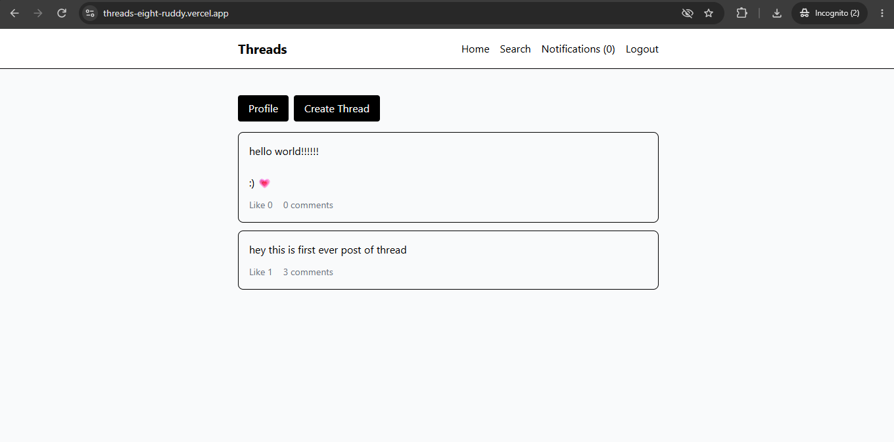
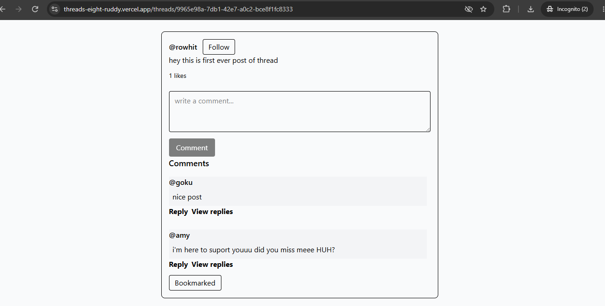
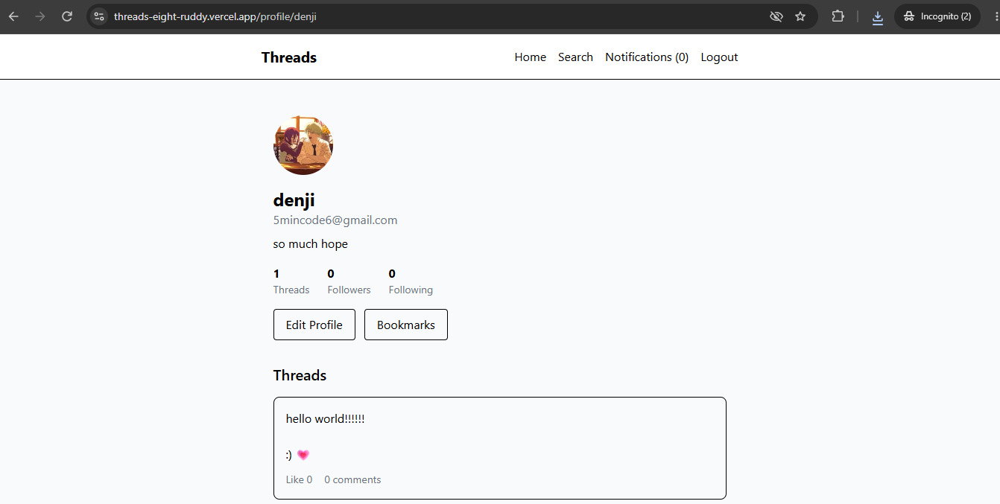
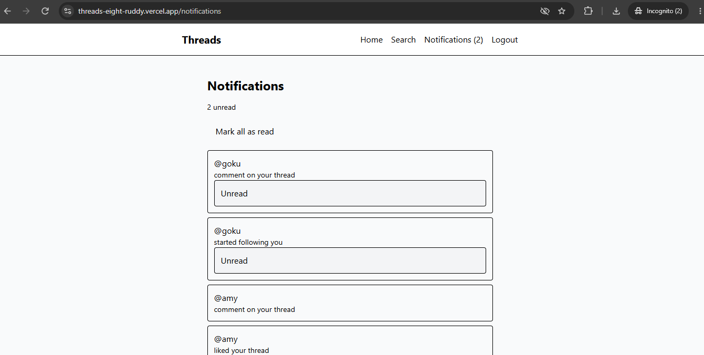
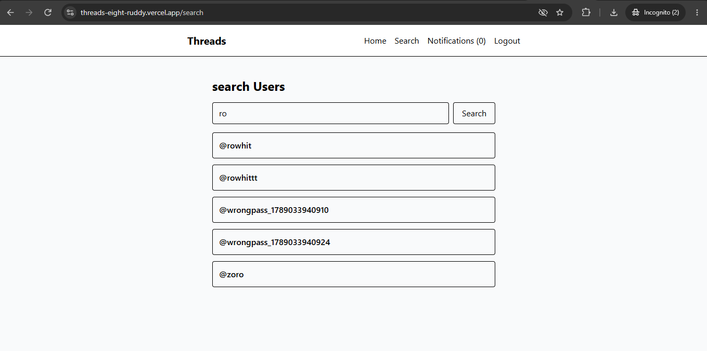
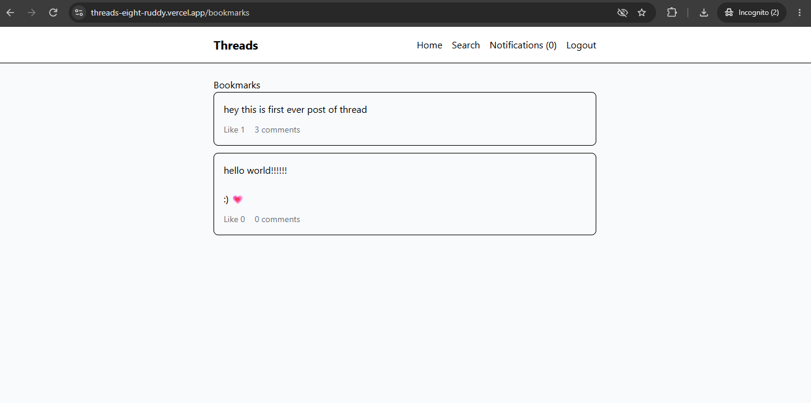
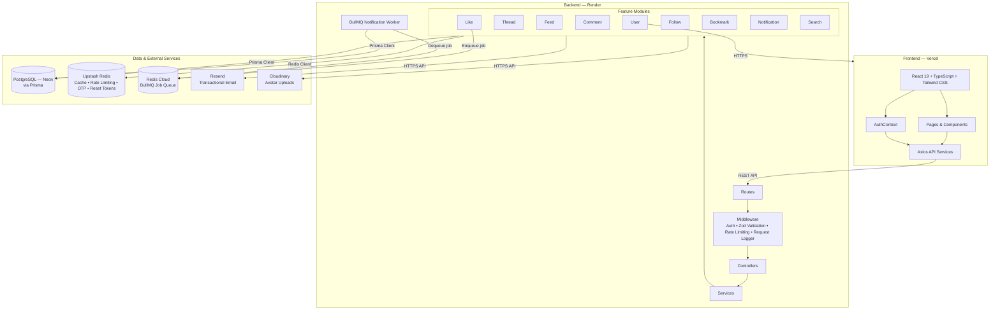

# Threads

A full-stack social media app inspired by Threads. Built to practice real backend engineering — not just CRUD, but auth, caching, pagination, transactions, async processing, horizontal scaling, observability, and load testing.

**Live:** https://threads-eight-ruddy.vercel.app

---

## Screenshots

### Home Feed


### Thread & Comments


### Profile


### Notifications


### Search


### Bookmarks


---

## Features

- Signup and login with JWT authentication
- Email verification with OTP
- Password reset via email
- Create, edit, and delete threads
- Personalized feed with Redis caching
- Like and unlike threads
- Comments and nested replies
- Follow and unfollow users
- Bookmarks
- User search
- In-app notifications (likes, follows, comments)
- Profile editing with avatar upload
- Ownership-based authorization
- Redis-backed rate limiting
- Async like notifications via BullMQ
- Structured request logging with request IDs
- Backend integration tests
- GitHub Actions CI with protected main branch

---

## Architecture


```mermaid
flowchart TD

    User((User Browser))

    subgraph Frontend["Frontend — Vercel"]
        React["React 19 + TypeScript + Tailwind CSS"]
        Auth["AuthContext"]
        Pages["Pages & Components"]
        Axios["Axios API Services"]

        React --> Pages
        React --> Auth
        Pages --> Axios
        Auth --> Axios
    end

    subgraph Backend["Backend — Render"]
        Routes["Routes"]
        Middleware["Middleware\nAuth • Zod Validation • Rate Limiting • Request Logger"]
        Controllers["Controllers"]
        Services["Services"]

        Routes --> Middleware
        Middleware --> Controllers
        Controllers --> Services

        subgraph Modules["Feature Modules"]
            User["User"]
            Thread["Thread"]
            Feed["Feed"]
            Comment["Comment"]
            Like["Like"]
            Follow["Follow"]
            Bookmark["Bookmark"]
            Notification["Notification"]
            Search["Search"]
        end

        Services --> Modules

        Worker["BullMQ Notification Worker"]
    end

    subgraph Infrastructure["Data & External Services"]
        PostgreSQL[("PostgreSQL — Neon\nvia Prisma")]
        Redis[("Upstash Redis\nCache • Rate Limiting • OTP • Reset Tokens")]
        RedisCloud[("Redis Cloud\nBullMQ Job Queue")]
        Resend["Resend\nTransactional Email"]
        Cloudinary["Cloudinary\nAvatar Uploads"]
    end

    User -->|"HTTPS"| Frontend
    Axios -->|"REST API"| Routes

    Modules -->|"Prisma Client"| PostgreSQL
    Modules -->|"Redis Client"| Redis
    Like -->|"Enqueue job"| RedisCloud
    Worker -->|"Dequeue job"| RedisCloud
    Worker -->|"Prisma Client"| PostgreSQL
    Modules -->|"HTTPS API"| Resend
    Modules -->|"HTTPS API"| Cloudinary
```

**Backend module structure**

Each feature has its own folder with a route, controller, service, and validation file.

```
src/modules/
├── user/
├── thread/
├── feed/
├── comments/
├── follow/
├── like/
├── bookmarks/
├── notification/
└── search/

src/queue/
├── notification.queue.ts
└── notification.worker.ts
```

Request lifecycle:

```
Route → Middleware → Controller → Service → Prisma / Redis / External APIs
```

---

## Core Request Flows

### Feed

```
GET /user/feed
→ auth middleware
→ check Redis cache (feed:user:{userId}:cursor:{cursor}:limit:{limit})
→ cache hit: fetch thread data + like state from PostgreSQL, return
→ cache miss: acquire distributed lock
  → lock acquired: query follow graph + threads from PostgreSQL
                   store thread IDs in Redis (TTL 60–90s with jitter)
                   release lock
  → lock not acquired: poll Redis every 50ms (max 10 retries)
→ fetch fresh thread data + like state from PostgreSQL
→ return feed
```

Only thread IDs and pagination metadata are cached — not full thread objects. `isLiked` and `likesCount` are always read fresh from PostgreSQL.

### Like

```
POST /threads/:threadId/likes
→ auth middleware
→ PostgreSQL transaction: create/delete Like + update likesCount
→ if liking (not unliking) and author ≠ actor:
    enqueue job to BullMQ notification queue (Redis Cloud)
→ HTTP response returned
→ (async) notification worker dequeues job
→ notification service checks for existing notification
→ create Notification in PostgreSQL
```

The core Like transaction is synchronous. Notification creation is asynchronous and does not block the response.

### Create Thread

```
POST /threads
→ auth middleware
→ create Thread in PostgreSQL
→ invalidate feed cache for author (scan + delete feed:user:{authorId}:*)
→ invalidate feed cache for all followers
→ return thread
```

### Notification

```
GET /notifications
→ auth middleware
→ fetch notifications from PostgreSQL with cursor pagination
→ include actor (username, avatar), thread, comment context
```

### Search

```
GET /users/search/:username
→ auth middleware
→ PostgreSQL ILIKE query on username
→ offset pagination (simpler ordered result set)
```

---

## Data Model

7 models in PostgreSQL managed through Prisma migrations.

| Model | Purpose |
|---|---|
| User | Accounts, profile, denormalized follower/following counts |
| Thread | Posts with denormalized likesCount and commentsCount |
| Like | Thread likes — unique on (userId, threadId) |
| Comment | Comments and nested replies via self-referential parentId, soft-deleted via deletedAt |
| Follow | User relationships — unique on (followingId, followerId) |
| Bookmark | Saved threads — unique on (userId, threadId) |
| Notification | Activity notifications (LIKE, FOLLOW, COMMENT) with read state |

Indexes: `Thread(authorId, createdAt)`, `Comment(threadId, parentId, createdAt)`, `Comment(parentId, createdAt)`, `Follow(followerId)`, `Follow(followingId)`, `Bookmark(userId, createdAt)`, `Bookmark(threadId)`, `Notification(recipientId, createdAt)`, `Notification(recipientId, read)`.

---

## Engineering & Scalability

This project went through a structured scalability study using the methodology:

**BASELINE → CHANGE → TEST → COMPARE**

Each sprint investigated one layer of the system under controlled load using k6 constant-arrival-rate tests.

---

### Workload & Baseline

1M registered users is treated as a long-term scale scenario, not a claim that the current application supports 1M users. What matters is the actual workload: active users, requests per user, traffic distribution, endpoint mix, read/write ratio, concurrency, peak traffic, and data size.

Critical journeys identified: authentication, feed retrieval, viewing threads, creating threads, likes, comments, follows, search, bookmarks, notifications.

A dedicated benchmark dataset was generated separately from the normal development seed. k6 was used with constant-arrival-rate testing against the authenticated feed endpoint on local PostgreSQL + Redis.

**Local benchmark results — feed endpoint:**

| Target RPS | Actual RPS | Completed | HTTP errors | p95 latency |
|---|---|---|---|---|
| 10 | 10.00 | 300 | 0% | 40.06 ms |
| 25 | 25.00 | 750 | 0% | 22.16 ms |
| 50 | 50.00 | 1,501 | 0% | 24.02 ms |
| 100 | 92.53 | 2,776 | 0% | 71.07 ms |

At 100 RPS, k6 dropped 224 iterations and max latency reached ~1.3s. Zero HTTP errors does not mean the system sustained the workload — dropped iterations indicate the system/load-generator combination was under pressure. The 10/25/50 RPS tests sustained their requested arrival rates without dropped iterations.

These are local benchmark results under a defined workload, not absolute capacity numbers.

---

### PostgreSQL Performance

Investigated the actual SQL generated by Prisma for the feed endpoint using `EXPLAIN` and `EXPLAIN ANALYZE` against a 100K user / 500K thread dataset.

Key findings:
- The existing `Thread(authorId, createdAt)` composite index is used for author-based feed queries
- PostgreSQL switches from index lookups to hash joins and parallel sequential scans as follower fan-out increases — query plans are workload-dependent
- Connection pool contention increases request latency under concurrent load; multiple API instances multiply PostgreSQL connections
- Denormalized counters (`likesCount`, `commentsCount`, `followerCount`, `followingCount`) are kept consistent via Prisma transactions

The investigation did not find sufficient evidence to justify changing the existing indexing or query structure. That is itself a valid engineering result.

**Local benchmark results — same feed endpoint after PostgreSQL investigation:**

| Target RPS | Actual RPS | HTTP errors | p95 latency | Dropped iterations |
|---|---|---|---|---|
| 10 | 10.02 | 0% | 52.12 ms | 0 |
| 50 | 47.31 | 0% | 53.55 ms | 81 |
| 100 | 91.45 | 0% | 243.08 ms | 253 |

Higher arrival rates produce increasing tail latency and dropped iterations. Completed requests continued to return without HTTP errors.

---

### Redis & Caching

Redis is used as a performance and shared-state layer. PostgreSQL remains the source of truth.

**Feed cache:**

Cache key: `feed:user:{userId}:cursor:{cursor}:limit:{limit}`

Only thread IDs and pagination metadata are cached. Thread data and like state are always fetched fresh from PostgreSQL on every request, so `isLiked` and `likesCount` are never stale.

Cache is invalidated when a user follows/unfollows someone or creates a thread. Like/unlike does not invalidate the cache.

**Cache reliability:**

Three layers protect against cache failure modes:

1. **TTL jitter** (`60 + random(0–30)` seconds) — spreads expirations to prevent synchronized mass expiry (cache avalanche)
2. **Distributed lock** (`SET NX EX`) — on cache miss, only one request queries PostgreSQL; others poll every 50ms for up to 500ms (cache stampede)
3. **Redis health check** (`redisClient.isReady`) — if Redis is unavailable, the feed falls back to PostgreSQL directly without crashing

**Measured cache behavior (local, small dataset):**

| State | avg latency | p95 latency |
|---|---|---|
| Cold cache | ~24.48 ms | 27.4 ms |
| Warm cache | ~13.45 ms | 19.4 ms |

Observed TTL ~62 seconds during testing. Memory experiment reached ~431 keys / 1.74 MB with a 2 MB maxmemory + allkeys-LRU configuration. Evicted keys remained 0 during the tested workload — eviction was configured but not triggered by this workload.

**Rate limiting:**

Redis-backed fixed-window counter using `INCR` + `EXPIRE` — 100 requests per 60 seconds per IP. Under concurrent load (20 VUs, 20 iterations), the limiter produced 5 HTTP 200 and 15 HTTP 429 responses, confirming shared state enforcement across concurrent requests.

---

### Feed Architecture

The feed uses fan-out on read: when a user requests their feed, the backend queries the follow graph and fetches threads from followed users at read time.

Fan-out on write (pre-computing feeds into per-user lists on every post) was evaluated and deliberately not implemented. The current workload does not justify the additional write amplification, storage, and invalidation complexity that fan-out on write introduces. The celebrity problem (users with millions of followers causing massive write fan-out) is a real concern at scale, but not at the current workload.

The current approach — cursor pagination + PostgreSQL + Redis cache-aside + cache invalidation — is appropriate for the demonstrated workload.

---

### Horizontal Scaling

The API is stateless: JWT authentication, PostgreSQL for persistent state, Redis for shared state, Cloudinary for media. No critical application state lives in process memory.

Health (`/health`) and readiness (`/ready`) endpoints distinguish between a running process and one that can reach PostgreSQL. Graceful shutdown handles SIGTERM and SIGINT: stop accepting new connections, finish in-flight requests, disconnect Prisma and Redis, exit.

**Production deployment** runs as a single Render instance. Horizontal scaling was investigated as a local experiment only.

**Local horizontal-scaling experiment:**

Nginx was configured as a load balancer in front of 3 local Node/Express instances (ports 5000, 5001, 5002) with Nginx listening on port 8081. The Nginx configuration was maintained outside the repository (`upstream threads_api` with `proxy_pass`) and is not part of the production setup.

Local experiment setup:
```
Client → Nginx :8081 → Node :5000
                     → Node :5001
                     → Node :5002
```

**Benchmark results through Nginx (single machine — does not demonstrate linear scaling):**

| Instances | p95 latency |
|---|---|
| 1 | ~166 ms |
| 2 | ~56 ms |
| 3 | ~47 ms |

Latency improved significantly with additional instances. This was a single-machine benchmark — shared resources (PostgreSQL, Redis, CPU, memory, network) remain potential bottlenecks. Traffic reaching different process PIDs was verified, and continued service when one instance was stopped was confirmed.

---

### Async Processing

Like notifications are processed asynchronously via BullMQ.

**Flow:**

```
Like request
→ PostgreSQL transaction (Like created + likesCount updated)
→ job enqueued to BullMQ queue (Redis Cloud)
→ HTTP response returned immediately
→ (async) notification worker processes job
→ createNotification checks for existing notification
→ Notification written to PostgreSQL
```

Queue configuration: 3 retry attempts, exponential backoff, initial delay 1000ms.

The notification worker runs in the same server process, started via a side-effect import in `server.ts`. In test environments, the queue is set to `null` to prevent open connections from blocking Jest.

**Idempotency:** `createNotification` checks for an existing notification with the same `(recipientId, actorId, type, threadId)` before creating a new one. This is a best-effort check — there is no database unique constraint on this combination, so it is not fully race-safe under concurrent workers. This was an accepted tradeoff given the current project scope.

**Failure behavior tested:**
- Worker stopped → jobs queued → worker restarted → jobs processed
- Retries exhausted → failed jobs inspectable in BullMQ
- Worker slowed → jobs accumulated in queue → drained on recovery

Two separate Redis connections are used: Upstash (node-redis client) for cache/rate limiting/OTP, Redis Cloud (ioredis via BullMQ) for the job queue. Upstash's HTTP-based free tier does not support the persistent TCP connections BullMQ requires.

---

### Observability

Structured JSON logging is implemented across the request lifecycle.

**Request logger middleware** generates a UUID `requestId` per request and emits two log entries:

```json
{ "timestamp": "...", "level": "info", "message": "request received", "requestId": "...", "method": "GET", "path": "/api/v1/user/feed" }
{ "timestamp": "...", "level": "info", "message": "request completed", "requestId": "...", "method": "GET", "path": "/api/v1/user/feed", "statusCode": 200, "durationMs": 14.23 }
```

Log level by status code: 2xx → `info`, 4xx → `warn`, 5xx → `error`.

A full Prometheus/Grafana metrics stack was not implemented. PostgreSQL, Redis, and Node.js observability (connections, query latency, hit ratio, memory, event loop) was studied at the theory level as part of the scalability investigation.

---

## Capacity Planning

These are illustrative capacity-planning calculations, not measured capabilities.

Using a hypothetical 1M registered user scenario:

```
1M registered users
→ 20% DAU = 200K active users/day
→ 50 requests/user/day = 10M requests/day
→ 10M / 86,400 ≈ 116 average RPS
→ 5× peak multiplier ≈ 580 peak RPS
```

At 580 peak RPS with a hypothetical endpoint distribution (60% feed, 15% thread views, 10% likes, etc.), the DB QPS and Redis operations per second can be estimated per endpoint. These numbers are useful for reasoning about infrastructure requirements, not for claiming current system capacity.

---

## Failure Scenarios

| Component | Behavior |
|---|---|
| Redis unavailable | Feed falls back to PostgreSQL directly. Rate limiting allows all requests through. OTP/reset token operations fail. |
| PostgreSQL unavailable | Most data operations fail. Server starts but requests return errors. |
| API instance crashes | Other instances continue serving traffic if Nginx/load balancer is in front. Stateless design means no session state is lost. |
| Queue unavailable (Redis Cloud) | Like transaction still succeeds. Notification job fails to enqueue — notification may not be created. There is no atomic DB+queue transaction. |
| Worker crashes | Queued jobs survive in Redis. Worker restarts and processes them with retry/backoff. Jobs that exhaust retries move to the failed set. |

---

## Architecture Decisions

**PostgreSQL over MongoDB** — the data is relational (users, follows, likes, comments, notifications all reference each other). Transactions, foreign keys, and composite indexes are used throughout. A document store would not be a better fit for this workload.

**Redis for cache and shared state** — reduces repeated follow-graph queries on the feed, provides shared rate-limit counters across instances, stores short-lived OTP and reset tokens.

**Cursor pagination over offset** — feed-style ordered data changes frequently. Offset pagination causes row drift when new items are inserted. Cursor pagination is stable. User search uses offset pagination since it's a simpler ordered result set.

**Cache-aside over write-through** — explicit application control over what gets cached and when. Simple to reason about. Appropriate for the current workload.

**Fan-out on read over fan-out on write** — fan-out on write would require pre-computing feeds for all followers on every post, introducing write amplification and complex invalidation. The current workload does not justify that complexity.

**BullMQ over inline notification creation** — notification work does not need to block the Like response. BullMQ with Redis Cloud is sufficient for the current workload.

**BullMQ over Kafka** — Kafka's operational complexity (brokers, partitions, consumer groups, offset management) is not justified by the current workload or team size.

**Modular monolith over microservices** — service decomposition would introduce network calls between services, service discovery, distributed tracing, cross-service consistency problems, and deployment complexity without a demonstrated need. The feature-based module structure keeps concerns separated without that overhead.

**No sharding** — there is no evidence that a single PostgreSQL instance is insufficient for the current or near-term workload.

---

## Testing

Integration tests use Jest and Supertest against a real PostgreSQL database and Redis instance. The `sendMail` function is mocked so tests don't depend on Resend. The BullMQ queue is set to `null` in test environment to prevent open connections from blocking Jest.

| Test | What it checks |
|---|---|
| `GET /health` | Server is up |
| `POST /users/signup` | Creates user, returns id/username/email, no password in response |
| `POST /users/login` (valid) | Returns access token, sets refresh cookie |
| `POST /users/login` (wrong password) | Returns 401 |
| `POST /threads` (authenticated) | Creates thread |
| `POST /threads` (no token) | Returns 401 |

---

## CI/CD

GitHub Actions runs on every push to `main` and every PR targeting `main`.

Steps:
1. Start PostgreSQL 16 service container
2. Start Redis 7 service container
3. Install backend dependencies
4. Run Prisma migrations
5. Run backend tests
6. Install frontend dependencies
7. Build frontend

`main` is protected — direct pushes are blocked, and the CI job must pass before any PR can be merged.

Deployment flow:
```
Feature branch → Pull Request → CI passes → Merge to main → Vercel + Render auto-deploy
```

---

## Deployment

**Frontend → Vercel**
Connected to the GitHub repo, auto-deploys from `main`. A `vercel.json` rewrite rule makes React Router work on direct navigation and refresh.

**Backend → Render**
- Build: `npm install --include=dev && npx prisma generate && npx prisma migrate deploy`
- Start: `npx tsx src/server.ts`

The backend runs TypeScript source directly via `tsx`. Migrations run automatically on each deploy. The BullMQ notification worker starts as part of the same process via a side-effect import in `server.ts`.

Note: Render's free tier spins down after inactivity. The first request after idle will be slow due to cold start.

---

## Local Development

**Prerequisites:** Node.js 22, PostgreSQL, Redis

```bash
# Backend
cd backend
cp .env.example .env
# fill in the variables

npm install
npx prisma migrate deploy
npm run dev
# runs on http://localhost:5000

# Seed with faker data (optional)
npm run seed

# Tests
npm test
```

```bash
# Frontend (separate terminal)
cd frontend
npm install
# create .env with VITE_API_URL=http://localhost:5000
npm run dev
# runs on http://localhost:5173
```

---

## Tech Stack

**Backend**
- Node.js, Express 5, TypeScript
- PostgreSQL + Prisma ORM
- Redis (node-redis)
- BullMQ + ioredis (async job queue)
- Zod (request validation)
- JWT + bcrypt
- Helmet, CORS
- Resend (transactional email)
- Cloudinary (avatar uploads)

**Frontend**
- React 19, TypeScript, Vite
- React Router v7
- Axios
- Tailwind CSS v4

**Testing & CI**
- Jest, Supertest, SWC/Jest
- GitHub Actions

**Load Testing**
- k6 (constant-arrival-rate)

**Production**
- Vercel (frontend)
- Render (backend)
- Neon (PostgreSQL)
- Upstash (Redis — cache, rate limiting, OTP, reset tokens)
- Redis Cloud (Redis — BullMQ job queue)
- Resend (email)

---

## Environment Variables

**Backend**

| Variable | Description |
|---|---|
| `PORT` | Server port |
| `DATABASE_URL` | PostgreSQL connection string |
| `REDIS_URL` | Upstash Redis connection string |
| `BULLMQ_REDIS_URL` | Redis Cloud connection string for BullMQ job queue |
| `ACCESS_TOKEN` | JWT secret for access tokens |
| `REFRESH_TOKEN` | JWT secret for refresh tokens |
| `RESEND_API_KEY` | Resend API key for email |
| `CLOUDINARY_CLOUD_NAME` | Cloudinary cloud name |
| `CLOUDINARY_API_KEY` | Cloudinary API key |
| `CLOUDINARY_API_SECRET` | Cloudinary API secret |
| `CLIENT_URL` | Frontend origin for CORS |
| `NODE_ENV` | `development` / `production` / `test` / `Benchmark` |

**Frontend**

| Variable | Description |
|---|---|
| `VITE_API_URL` | Backend API base URL |

Never commit real values to the repository.
